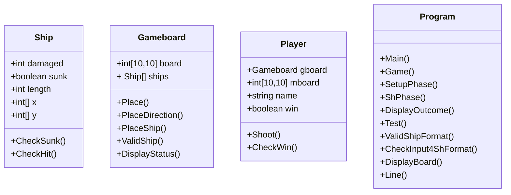

# **Battleships Assignment**
#### _Jack Pang_
# Content
1. Design
2. Code
3. Test Evidence
# Design
## **Class Diagram**


## Class Ship
### Properties:
- int damaged
- boolean sunk
- int length
- int[] x
- int[] y

### Initializer:
```
PUBLIC Damamged AS INT get{damaged}
PUBLIC Sunk AS BOOLEAN get{sunk}
PUBLIC X AS INT[] get{x}set{value = x}
PUBLIC Y AS INT[] get{y}set{value = y}
```
### Constructor:
```
PUBLIC PROCEDURE Ship (INT l = 0, INT d = 0)
	Damaged = d
	Length = l
	Sunk = false
	X = new int[l]
	Y = new int[l]
```
### Methods:
- Checksunk()
	- In: none
	- Out: boolean sunk
```
CREATE FUNCTION Checksunk()
	IF damaged = length THEN
		sunk = true
	ENDIF
	RETURN sunk
ENDFUNCTION
```

- CheckHit()
	- In: int x, int y, Ship s
	- Out: boolean hit
```
CREATE FUNCTION CheckHit(int x, int y, Ship s)
	DECLARE hit AS BOOLEAN = false
	DECLARE len AS s.Length
	FOR i = 0 TO len - 1
		IF s.X[i] = x AND s.Y[i] = y THEN
			s.Damage++
		ENDIF
	NEXT
	RETURN hit
ENDFUNCTION
```
----
## Class Gameboard
### Properties:
- int[10,10] board
- Ship[] ships

### Initializer
```
PUBLIC Board AS int[,] get{board}set{value = board}
PUBLIC Ships AS Ship[] get{ships}
```
### Constructor:
```
PUBLIC Gameboard
	ships[0] = new Ship(0,2)
	ships[1] = new Ship(0,3)
	ships[2] = new Ship(0,3)
	ships[3] = new Ship(0,4)
	ships[4] = new Ship(0,5)
```
### Methods:
- PlaceShip
	- In: Int n, String command, Bool valid
	- Out: none
```
CREATE PROCEDURE PlaceShip(Int n, String command, Bool valid)
	IF valid
		DECLARE commands AS String[] = command.Split(",")
		DECLARE x AS Int = Convert2Int(commands[0])
		DECLARE y AS Int = Convert2Int(commands[1])
		DECLARE d AS String = commands[2]
		DECLARE s AS Ship = ships[n]
		DECLARE len AS INT = s.Length
		IF d = "1" THEN
			FOR INT i = 0 To len - 1
				board[y+i,x] = ship[i]
				ship[n].Y[i] = y+i
				ship[n].X[i] = x
			ENDFOR
		ELSE 
			FOR INT i = 0 To len - 1
				board[y,x+i] = 1
				ship[n].X[i] = x+i
				ship[n].Y[i] = y
			ENDFOR
		ENDIF
	ENDIF
ENDPROCEDURE
```
- ValidShip
	- In: Int n, String command
	- Out: boolean valid
```
CREATE FUNCTION ValidShip(int n, int x, int y)
	DECLARE valid AS BOOLEAN = false
	DECLARE count AS INT = 0
	FOR INT i = 0 To n - 1
		IF board[x,y+i] != 1 OR board[x+1,y] != 1 THEN
			count++
		ENDIF
	ENDFOR
	IF count = n NEXT
		valid = true
	ENDIF
	RETURN valid
ENDFUNCTION
```
- DisplayStatus
	- In: none
	- Out: none
```
CREATE PROCEDURE DisplayStatus()
	DECLARE len AS Int = ships.Length
	DECLARE status AS String = ""
	status+="Ship"+"    "
ENDPROCEDURE
```

----
## Class Player
### Properties
- Gameboard gboard
- int[10,10] mboard
- string name
- boolean win

### Initializer:
```
PUBLIC Name AS STRING {get(name),set(name = value)}
PUBLIC Gboard AS Gameboard {get(gboard),set(gboard = value)}
PUBLIC Mboard AS INT[,] {get(mboard),set(mboard = value)}
PUBLIC Win AS BOOLEAN {get(win),set(win = value)}
```

### Constructor:
```
PUBLIC Player(string n = "player")
	Gboard = new Gameboard() 
	Name = n
	Win = w
```

### Methods:
- Shoot()
	- In: player.Gboard nshooter, int x, int y
	- Out: outcome boolean
```
CREATE FUNCTION Shoot(nshooter AS player.Gboard, int x, int y)
	DECLARE outcome AS BOOLEAN = false
	FOR i = 0 TO 4
		IF nshooter.ships[i].CheckHit(x,y) = true THEN
			nshooter.board[x,y] = nshooter.board[x,y] - 2
			outcome = true
		ENDIF
	NEXT
	RETURN outcome
ENDFUNCTION
```
- CheckWin()
	- In: Player nshooter
	- Out: nshooter.win
```
CREATE PROCEDURE CheckWin(nshooter AS Player)
	DECLARE counter AS INT = 0
	FOR i = 0 TO 4
		IF nshooter.Gboard.ships[i].CheckSunk() = true THEN
			counter++
		ENDIF
	NEXT
	IF counter = 5 THEN
		nshooter.win = true
	ELSE
		nshooter.win = false
	ENDIF
ENDPROCEDURE
```
----
## Class Program
### Methods
- Main()
  - In: none
  - Out:none
```
CREATE PRCOCEDURE Main()
	DECLARE resume AS BOOLEAN = true
	DECLARE opt AS STRING
	WHILE(resume)
		OUTPUT "1)Game mode 2)Test mode 3)Quit"
		opt = USERINPUT
		IF opt="1"
			Game()
		ELSE IF opt="2"
			Test()
		ELSE 
			resume=false
	ENDWHILE
ENDPROCEDURE
```
- Game()
	- In: none
	- Out: none
```
CREATE PROCEDURE Game()
	OUTPUT "Welcome to BattleShips"
	DECLARE player1 AS Player
	DECLARE player2 AS Player
	OUTPUT "ENTER 1st Player name"
	DECLARE player1.Name AS STRING = USERINPUT
	OUTPUT "ENTER 2nd Player name"
	DECLARE player2.Name AS STRING = USERINPUT
	SetupPhase(player1)
	SetupPhase(player2)
	WHILE player1.Win = false AND player2.Win = false
		ShPhase(player1,player2)
		ShPhase(player2,player1)
	ENDWHILE
	IF player1.Win = true THEN
		OUTPUT "{player1.Name} Win"
	ELSE
		OUTPUT "{player2.Name} Win"
	ENDIF
ENDPROCEDURE
```
- SetupPhase
	- In: Player player
	- Out: None
```
CREATE PROCEDURE SetupPhase(Player player)
	OUTPUT "{player.Name}:"
	DECLARE i AS INT = 0
	WHILE i<5
		DECLARE ch AS string
		DECLARE valid AS BOOLEAN
		OUTPUT "1)Enter Ship |{i+1}| 2)Displayboard"
		ch = USERINPUT
		IF ch="1"
			valid=player.Gboard.Place(i)
			IF (valid)
				OUTPUT "Ship Valid"
				i++
			ELSE 
				OUTPUT "Ship not Valid"
			ENDIF
		ELSEIF ch="2"
			DisplayBoard(player.Gboard.Board)
		ELSE
			OUTPUT "Wrong Input"
		ENDIF
	ENDWHILE
	DisplayBoard(player.Gboard.Board)
ENDPROCEDURE
```

- ShootingPhase
	- In: Player shooter, Player nshooter
	- Out: None
```
CREATE PROCEDURE ShPhase(shooter AS Player,nshooter AS Player)
	OUTPUT "{shooter.Name}"
	OUTPUT "ENTER the x coordinates to shoot"
	DECLARE x AS INT = CheckInput(USERINPUT)
	OUTPUT "ENTER the y coordinates to shoot"
	DECLARE y AS INT = CheckInput(USERINPUT)
	result=nshooter.Shoot(x,y)
	shooter.Gboard.Maskboard(shooter.Mboard)
	DisplayOutcome(nsh,result)
	shooter.CheckWin(nshooter)
ENDPROCEDURE
```
- CheckInput 
	- In: string x _Whatever needs to be converted into INT 
	- Out: int y
```
CREATE FUNCTION CheckInput(STRING x)
	DECLARE success AS BOOLEAN = false
	WHILE success = false
		IF CONVERTTOINT(x, out y) = true THEN
			success = true
		Else //ask again for input
			OUTPUT "Wrong INPUT, Enter again"
			a = USERINPUT
			x = a
		ENDIF
	ENDWHILE
	RETURN y
ENDFUNCTION
```
- DisplayOutcome
	- In: Player pl, boolean result _from Shoot_
	- Out: none
```
CREATE PROCEDURE DisplayOutcome(BOOLEAN result)
	IF result = true
		OUTPUT "Hitted"
	ELSE
		OUTPUT "Nothing is hit"
	ENDIF
	pl.Gboard.DisplayStatus()
ENDPROCEDURE
```
- DisplayBoard()
  - In: int[,] board
  - Out: none
```
CREATE PROCEDURE DisplayBoard()
	DECLARE len AS INT = board.GetLength(0)
	line(len)
	FOR INT x = -1 To len - 1
		OUTPUT "|"
		OUTPUT "{x}"
	ENDFOR
	FOR INT i = 0 To len - 1
		OUTPUT "|"
		OUTPUT "{i}"
		FOR INT j = 0 To len - 1
			OUTPUT "|"
			OUTPUT "board[i,j]"
		ENDFOR
		OUTPUT "|"
		OUTPUT ""
	ENDFOR
ENDPROCEDURE
```
- line()
  - In: int len
  - Out: none
```
CREATE PROCEDURE line(int len)
    FOR INT i = 0 To len
		OUTPUT "+---"
	ENDFOR
    OUTPUT "+"
ENDPROCEDURE
```
----
# Decomposition
## Program 
> Main()
  - request for what mode is the game running in eg. Test mode or Game mode
> Test()
  - runs the testing code of the game to test all of the classes and methods
  	- TestSetupPhase()
		- Setup the board from preset values
  	- TestShPhase()
		- Shoots opponent's board from preset values
  	- ForceWin()
		- Shoots every ship on opponent's board
> Game()
  - runs the game until a player has won
> SetupPhase()
  - Setup the board from userinput
> ShPhase
  - Shoots opponent's board from userinput
> DisplayOutcome 
  - Return the outcome of after shoot
> CheckInput() 
  - Checks all the userinput to check if it is correct format
> DisplayBoard()
  - Return the board As a string
> Line()
  - Return a new line As a string
----
# Test Evidence
## Program
- Testing classes: Ship, Gameboard and Player
- Tested: Ship.Length, Gameboard.PlaceShip(), Gameboard.DisplayBoard(), Player.Name
> This code is to test the function of Placing the ships on the board through entering the x, y coordinates. Then display the board out after the ship is placed
```
CREATE PROCEDURE TestSetupPhase(Player pl)
	Console.Write($"{pl.Name}:\n");
	OUTPUT ValidShipFormat(0,pl,"4,4,1");
	pl.Gboard.PlaceShip(0,"4,4,1",true);
	//return Ship Valid, ship in row 4, column 4, placed Vertically
	OUTPUT ValidShipFormat(1,pl,"0,0,2");
	pl.Gboard.PlaceShip(1,"0,0,2",true);
	//return Ship Valid, ship in row 0, column 0, placed Horizontally
	OUTPUT ValidShipFormat(2,pl,"0,9,2");
	pl.Gboard.PlaceShip(2,"0,9,2",true);
	//return Ship Valid, ship in row 9, column 0, placed Horizontally
	OUTPUT ValidShipFormat(3,pl,"0,9,1");
	//return Ship not Valid
	OUTPUT ValidShipFormat(3,pl,"0,5,1");
	pl.Gboard.PlaceShip(3,"0,5,1",true);
	//return Ship Valid, ship in row 5, column 0, placed Vertically
	OUTPUT ValidShipFormat(4,pl,"5,9,2");
	pl.Gboard.PlaceShip(4,"5,9,2",true);
	//return Ship Valid, ship in row 9, column 5, placed Horizontally
	OUTPUT ValidShipFormat(4,pl,"5,9,2");
	//return Ship not Valid
	OUTPUT DisplayBoard(pl.Gboard.Board);
	//Displays the Board
ENDPROCEDURE
```
>Output should look something like this
>
>the board is displayed with x, y(column, row ) coordinates in the first row of the board
>
>1 represents the part of the ship so you cannot actually tell which ship is which if they all stuck to each other 
```
Correct command
Correct command
Correct command
Wrong command
Correct command
Correct command
Wrong command

+---+---+---+---+---+---+---+---+---+---+---+
| -1| 0 | 1 | 2 | 3 | 4 | 5 | 6 | 7 | 8 | 9 |
+---+---+---+---+---+---+---+---+---+---+---+
| 0 | 1 | 1 | 1 | 0 | 0 | 0 | 0 | 0 | 0 | 0 |
+---+---+---+---+---+---+---+---+---+---+---+
| 1 | 0 | 0 | 0 | 0 | 0 | 0 | 0 | 0 | 0 | 0 |
+---+---+---+---+---+---+---+---+---+---+---+
| 2 | 0 | 0 | 0 | 0 | 0 | 0 | 0 | 0 | 0 | 0 |
+---+---+---+---+---+---+---+---+---+---+---+
| 3 | 0 | 0 | 0 | 0 | 0 | 0 | 0 | 0 | 0 | 0 |
+---+---+---+---+---+---+---+---+---+---+---+
| 4 | 0 | 0 | 0 | 0 | 1 | 0 | 0 | 0 | 0 | 0 |
+---+---+---+---+---+---+---+---+---+---+---+
| 5 | 1 | 0 | 0 | 0 | 1 | 0 | 0 | 0 | 0 | 0 |
+---+---+---+---+---+---+---+---+---+---+---+
| 6 | 1 | 0 | 0 | 0 | 0 | 0 | 0 | 0 | 0 | 0 |
+---+---+---+---+---+---+---+---+---+---+---+
| 7 | 1 | 0 | 0 | 0 | 0 | 0 | 0 | 0 | 0 | 0 |
+---+---+---+---+---+---+---+---+---+---+---+
| 8 | 1 | 0 | 0 | 0 | 0 | 0 | 0 | 0 | 0 | 0 |
+---+---+---+---+---+---+---+---+---+---+---+
| 9 | 1 | 1 | 1 | 0 | 0 | 1 | 1 | 1 | 1 | 1 |
+---+---+---+---+---+---+---+---+---+---+---+
```
- Testing Class: Ship, Gameboard, Player
- Tested: Player.Shoot(), 
> This code is to test the shooting phase of battleships
```
CREATE PROCEDURE TestShPhase(Player sh, Player nsh)
	//sh for shooter and nsh for nshooter
	OUTPUT "{sh.Name} Shooting -> {nsh.Name}"
	//Player1.Shoot(Player2,x,y) Player2 is the player who is getting shot and Player1 is the one shooting, x,y is column, row
	//I know it should be row, column for int[row,column], but don't have to effort to do that
	//shoot row 1, column 2 and row 9, column 0-3
	sh.Shoot(nsh,"1,2")
	sh.Shoot(nsh,"0,9")
	sh.Shoot(nsh,"1,9")
	sh.Shoot(nsh,"2,9")
	sh.Shoot(nsh,"3,9")
	//shoot row 5, column 0-4
	sh.Shoot(nsh,"0,5")
	sh.Shoot(nsh,"1,5")
	sh.Shoot(nsh,"2,5")
	sh.Shoot(nsh,"3,5")
	sh.Shoot(nsh,"4,5")
	//Display the MaskedBoard of the player getting shot as the board getting checked is it
	OUTPUT DisplayBoard(nsh.Mboard)
	OUTPUT "{nsh.Name} Board:"
	//Display the actual board of the player getting shot
	OUTPUT DisplayBoard(nsh.Gboard.Board)
	OUTPUT "{nsh.Name} Ships:"
	//Display the board status of the player getting shot
	OUTPUT nsh.Gboard.DisplayStatus()
	sh.CheckWin(sh,nsh)
ENDPROCEDURE
```
>Output should look something like this
>
>-1 is the Ship got shot and to represent that it was there, the value is set to -1.

```
Player1 Shooting -> Player2
+---+---+---+---+---+---+---+---+---+---+---+
| -1| 0 | 1 | 2 | 3 | 4 | 5 | 6 | 7 | 8 | 9
+---+---+---+---+---+---+---+---+---+---+---+
| 0 | 0 | 0 | 0 | 0 | 0 | 0 | 0 | 0 | 0 | 0 |
+---+---+---+---+---+---+---+---+---+---+---+
| 1 | 0 | 0 | 0 | 0 | 0 | 0 | 0 | 0 | 0 | 0 |
+---+---+---+---+---+---+---+---+---+---+---+
| 2 | 0 | 1 | 0 | 0 | 0 | 0 | 0 | 0 | 0 | 0 |
+---+---+---+---+---+---+---+---+---+---+---+
| 3 | 0 | 0 | 0 | 0 | 0 | 0 | 0 | 0 | 0 | 0 |
+---+---+---+---+---+---+---+---+---+---+---+
| 4 | 0 | 0 | 0 | 0 | 0 | 0 | 0 | 0 | 0 | 0 |
+---+---+---+---+---+---+---+---+---+---+---+
| 5 | 1 | 1 | 1 | 1 | 1 | 0 | 0 | 0 | 0 | 0 |
+---+---+---+---+---+---+---+---+---+---+---+
| 6 | 0 | 0 | 0 | 0 | 0 | 0 | 0 | 0 | 0 | 0 |
+---+---+---+---+---+---+---+---+---+---+---+
| 7 | 0 | 0 | 0 | 0 | 0 | 0 | 0 | 0 | 0 | 0 |
+---+---+---+---+---+---+---+---+---+---+---+
| 8 | 0 | 0 | 0 | 0 | 0 | 0 | 0 | 0 | 0 | 0 |
+---+---+---+---+---+---+---+---+---+---+---+
| 9 | 1 | 1 | 1 | 1 | 0 | 0 | 0 | 0 | 0 | 0 |
+---+---+---+---+---+---+---+---+---+---+---+

Player2 Board:
+---+---+---+---+---+---+---+---+---+---+---+
| -1| 0 | 1 | 2 | 3 | 4 | 5 | 6 | 7 | 8 | 9
+---+---+---+---+---+---+---+---+---+---+---+
| 0 | 1 | 1 | 1 | 0 | 0 | 0 | 0 | 0 | 0 | 0 |
+---+---+---+---+---+---+---+---+---+---+---+
| 1 | 0 | 0 | 0 | 0 | 0 | 0 | 0 | 0 | 0 | 0 |
+---+---+---+---+---+---+---+---+---+---+---+
| 2 | 0 | 0 | 0 | 0 | 0 | 0 | 0 | 0 | 0 | 0 |
+---+---+---+---+---+---+---+---+---+---+---+
| 3 | 0 | 0 | 0 | 0 | 0 | 0 | 0 | 0 | 0 | 0 |
+---+---+---+---+---+---+---+---+---+---+---+
| 4 | 0 | 0 | 0 | 0 | 1 | 0 | 0 | 0 | 0 | 0 |
+---+---+---+---+---+---+---+---+---+---+---+
| 5 | -1| 0 | 0 | 0 | -1| 0 | 0 | 0 | 0 | 0 |
+---+---+---+---+---+---+---+---+---+---+---+
| 6 | 1 | 0 | 0 | 0 | 0 | 0 | 0 | 0 | 0 | 0 |
+---+---+---+---+---+---+---+---+---+---+---+
| 7 | 1 | 0 | 0 | 0 | 0 | 0 | 0 | 0 | 0 | 0 |
+---+---+---+---+---+---+---+---+---+---+---+
| 8 | 1 | 0 | 0 | 0 | 0 | 0 | 0 | 0 | 0 | 0 |
+---+---+---+---+---+---+---+---+---+---+---+
| 9 | -1| -1| -1| 0 | 0 | 1 | 1 | 1 | 1 | 1 |
+---+---+---+---+---+---+---+---+---+---+---+

Player2 Ships:
Ship      Length    Damaged   Sunk
1         2         1         False
2         3         0         False
3         3         3         True
4         4         1         False
5         5         0         False
```
- Testing: Player.CheckWin()
- The Win condition works properly
>Added an code which forces one player to win in order to test the code fully
```
CREATE PROCEDURE ForceWin(Player sh,Player nsh)
	//sh for shooter and nsh for nshooter
	OUTPUT "{sh.Name} Shooting -> {nsh.Name}";
	//Shoots all the ship Cheat code
	FOR INT i = 0 To 9
		FOR INT j = 0 To 9
			IF (nsh.Gboard.Board[i,j]==1) // There is a ship THEN
				sh.Shoot(nsh,j,i)
			ENDIF
		ENDFOR
	ENDFOR
	// Display the Masked Version of the board, which displays where it shot
	OUTPUT DisplayBoard(nsh.Mboard)
	OUTPUT "{nsh.Name} Board:"
	//Display the actual board of the player getting shot
	OUTPUT DisplayBoard(nsh.Gboard.Board);
	OUTPUT "{nsh.Name} Ships:"
	//Display the board status of the player getting shot
	OUTPUT nsh.Gboard.DisplayStatus()
	sh.CheckWin(sh,nsh)
ENDPROCEDURE
```
> Output should look something like this
```
Player2 Shooting -> Player1
+---+---+---+---+---+---+---+---+---+---+---+
| -1| 0 | 1 | 2 | 3 | 4 | 5 | 6 | 7 | 8 | 9 |
+---+---+---+---+---+---+---+---+---+---+---+
| 0 | 1 | 1 | 1 | 0 | 0 | 0 | 0 | 0 | 0 | 0 |
+---+---+---+---+---+---+---+---+---+---+---+
| 1 | 0 | 0 | 0 | 0 | 0 | 0 | 0 | 0 | 0 | 0 |
+---+---+---+---+---+---+---+---+---+---+---+
| 2 | 0 | 0 | 0 | 0 | 0 | 0 | 0 | 0 | 0 | 0 |
+---+---+---+---+---+---+---+---+---+---+---+
| 3 | 0 | 0 | 0 | 0 | 0 | 0 | 0 | 0 | 0 | 0 |
+---+---+---+---+---+---+---+---+---+---+---+
| 4 | 0 | 0 | 0 | 0 | 1 | 0 | 0 | 0 | 0 | 0 |
+---+---+---+---+---+---+---+---+---+---+---+
| 5 | 1 | 0 | 0 | 0 | 1 | 0 | 0 | 0 | 0 | 0 |
+---+---+---+---+---+---+---+---+---+---+---+
| 6 | 1 | 0 | 0 | 0 | 0 | 0 | 0 | 0 | 0 | 0 |
+---+---+---+---+---+---+---+---+---+---+---+
| 7 | 1 | 0 | 0 | 0 | 0 | 0 | 0 | 0 | 0 | 0 |
+---+---+---+---+---+---+---+---+---+---+---+
| 8 | 1 | 0 | 0 | 0 | 0 | 0 | 0 | 0 | 0 | 0 |
+---+---+---+---+---+---+---+---+---+---+---+
| 9 | 1 | 1 | 1 | 0 | 0 | 1 | 1 | 1 | 1 | 1 |
+---+---+---+---+---+---+---+---+---+---+---+
Player1 Board:
+---+---+---+---+---+---+---+---+---+---+---+
| -1| 0 | 1 | 2 | 3 | 4 | 5 | 6 | 7 | 8 | 9 |
+---+---+---+---+---+---+---+---+---+---+---+
| 0 | -1| -1| -1| 0 | 0 | 0 | 0 | 0 | 0 | 0 |
+---+---+---+---+---+---+---+---+---+---+---+
| 1 | 0 | 0 | 0 | 0 | 0 | 0 | 0 | 0 | 0 | 0 |
+---+---+---+---+---+---+---+---+---+---+---+
| 2 | 0 | 0 | 0 | 0 | 0 | 0 | 0 | 0 | 0 | 0 |
+---+---+---+---+---+---+---+---+---+---+---+
| 3 | 0 | 0 | 0 | 0 | 0 | 0 | 0 | 0 | 0 | 0 |
+---+---+---+---+---+---+---+---+---+---+---+
| 4 | 0 | 0 | 0 | 0 | -1| 0 | 0 | 0 | 0 | 0 |
+---+---+---+---+---+---+---+---+---+---+---+
| 5 | -1| 0 | 0 | 0 | -1| 0 | 0 | 0 | 0 | 0 |
+---+---+---+---+---+---+---+---+---+---+---+
| 6 | -1| 0 | 0 | 0 | 0 | 0 | 0 | 0 | 0 | 0 |
+---+---+---+---+---+---+---+---+---+---+---+
| 7 | -1| 0 | 0 | 0 | 0 | 0 | 0 | 0 | 0 | 0 |
+---+---+---+---+---+---+---+---+---+---+---+
| 8 | -1| 0 | 0 | 0 | 0 | 0 | 0 | 0 | 0 | 0 |
+---+---+---+---+---+---+---+---+---+---+---+
| 9 | -1| -1| -1| 0 | 0 | -1| -1| -1| -1| -1|
+---+---+---+---+---+---+---+---+---+---+---+
Player1 Ships:
Ship      Length    Damaged   Sunk
1         2         2         True
2         3         3         True
3         3         3         True
4         4         4         True
5         5         5         True
Player2 Won
```
----