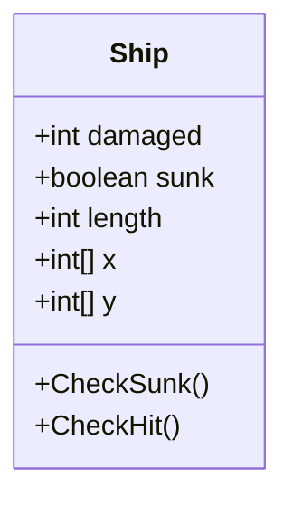
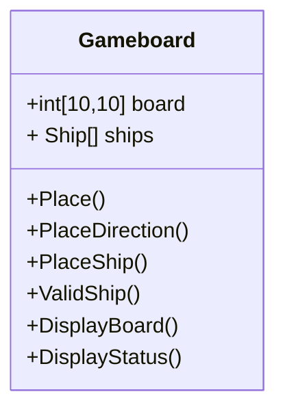
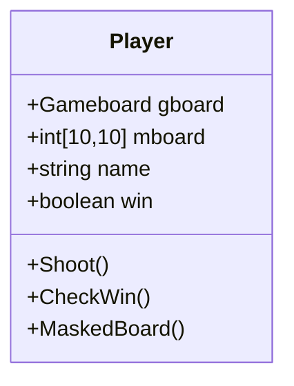

# **Battleships Assignment**

#### _Jack Pang_

# Design

----

## **Class Diagram** Ship


## Class Ship
### Properties:
- int damaged
- boolean sunk
- int length
- int[] x
- int[] y

### Initializer:
```
PUBLIC Damamged AS INT get{damaged}
PUBLIC Sunk AS BOOLEAN get{sunk}
PUBLIC X AS INT[] get{x}set{value = x}
PUBLIC Y AS INT[] get{y}set{value = y}
```
### Constructor:
```
PUBLIC PROCEDURE Ship (INT l = 0, INT d = 0)
	Damaged = d
	Length = l
	Sunk = false
	X = new int[l]
	Y = new int[l]
```
### Methods:
- Checksunk()
	- In: none
	- Out: boolean sunk
```
CREATE FUNCTION Checksunk()
	IF damaged = length THEN
		sunk = true
	ENDIF
	RETURN sunk
ENDFUNCTION
```

- CheckHit()
	- In: int x, int y, Ship s
	- Out: boolean hit
```
CREATE FUNCTION CheckHit(int x, int y, Ship s)
	DECLARE hit AS BOOLEAN = false
	DECLARE len AS s.Length
	FOR i = 0 TO len - 1
		IF s.X[i] = x AND s.Y[i] = y THEN
			s.Damage++
		ENDIF
	NEXT
	RETURN hit
ENDFUNCTION
```
----
## **Class Diagram** Gameboard


## Class Gameboard
### Properties:
- int[10,10] board
- Ship[] ships

### Initializer
```
PUBLIC Board AS int[,] get{board}set{value = board}
PUBLIC Ships AS Ship[] get{ships}
```
### Constructor:
```
PUBLIC Gameboard
	DECLARE len AS INT = board.Length 
	FOR INT i = 0 TO len
		FOR INT j = 0 TO len
			board[i,j] = 0
		ENDFOR 
	ENDFOR
	ships[0] = new Ship(0,2)
	ships[1] = new Ship(0,3)
	ships[2] = new Ship(0,3)
	ships[3] = new Ship(0,4)
	ships[4] = new Ship(0,5)
```
### Methods:
- Place
	- In: int n //Length of the ship
	- Out: int board
```
CREATE PROEDURE Place(INT n)
	//Enter x coordinates 0-9
	DECLARE x AS INT = Program.CheckInput(USERINPUT)
	//Enter y coordinates 0-9
	DECLARE y AS INT = Program.CheckInput(USERINPUT)
	board = PlaceShip(n,x,y,board)
ENDPROCEDURE
```
- PlaceDirection
	- In: None
	- Out: string d
```
CREATE FUNCTION PlaceDirection()
	DECLARE d AS STRING
	DECLARE success AS BOOLEAN = false
	WHILE success = false
		OUTPUT "1:Vertical 2:Horizontal"
		d = USERINPUT
		IF d = "1" OR d = "2" THEN
			success = true
			return d
		ELSE
			OUTPUT "Wrong Direction"
		ENDIF
	ENDWHILE
ENDFUNCTION
```
- PlaceShip
	- In: int n, int x, int y
	- Out: int[10,10] board
```
CREATE FUNCTION PlaceShip(INT n, INT x, INT y)
	DECLARE s AS Ship = ships[n]
	DECLARE len AS INT = s.Length
	IF len+y > 9 OR len+x > 9 OR ValidShip(n,x,y,board) = false THEN
		OUTPUT "CANNOT PUT SHIP THERE"
		OUTPUT "ENTER x,y again"
		Place(n)
	ELSE 
		IF PLaceDirection() = "1" THEN
			FOR INT i = 0 To len - 1
				board[x,y+i] = ship[i]
				ship[n].Y[i] = y+i
				ship[n].X[i] = x
			ENDFOR
			
		ELSE 
			FOR INT i = 0 To len - 1
				board[x+i,y] = 1
				ship[n].X[i] = x+i
				ship[n].Y[i] = y
			ENDFOR
		ENDIF
	ENDIF
	RETURN board
ENDFUNCTION
```
- ValidShip
	- In: Int x, Int y, Int n
	- Out: boolean valid
```
CREATE FUNCTION ValidShip(int n, int x, int y)
	DECLARE valid AS BOOLEAN = false
	DECLARE count AS INT = 0
	FOR INT i = 0 To n - 1
		IF board[x,y+i] != 1 OR board[x+1,y] != 1 THEN
			count++
		ENDIF
	ENDFOR
	IF count = n NEXT
		valid = true
	ENDIF
	RETURN valid
ENDFUNCTION
```
- DisplayBoard
	- In: none
	- Out: none
```
CREATE PROCEDURE DisplayBoard()
	DECLARE len AS INT = board.Length
	FOR INT i = 0 To len - 1
		FOR INT j = 0 To len - 1
			OUTPUT "board[i,j]".PadRight
		ENDFOR
	ENDFOR
ENDPROCEDURE
```
- DisplayStatus
	- In: none
	- Out: none
```
CREATE PROCEDURE DisplayStatus()
	FOR i = 0 TO 4
		OUTPUT "{ships[i].Damaged}"
		IF ships[i].Sunk = false THEN
			OUTPUT "ship {ships[i].Length} Not Sunk"
		ELSE 
			OUTPUT "ship {ships[i].Length} SUNKED"
		ENDIF
	ENDFOR
ENDPROCEDURE
```

----
## **Class Diagram** Player


## Class Player
### Properties
- Gameboard gboard
- int[10,10] mboard
- string name
- boolean win

### Initializer:
```
PUBLIC Name AS STRING {get(name),set(name = value)}
PUBLIC Gboard AS Gameboard {get(gboard),set(gboard = value)}
PUBLIC Mboard AS INT[,] {get(mboard),set(mboard = value)}
PUBLIC Win AS BOOLEAN {get(win),set(win = value)}
```

### Constructor:
```
PUBLIC Player(string n = "player")
	Name = n
	Win = w
	DECLARE len AS INT = mboard.Length 
	FOR INT i = 0 TO len
		FOR INT j = 0 TO len
			mboard[i,j] = 0
		ENDFOR 
	ENDFOR
```

### Methods:
- Shoot()
	- In: player.Gboard nshooter, int x, int y
	- Out: outcome boolean
```
CREATE FUNCTION Shoot(nshooter AS player.Gboard, int x, int y)
	DECLARE outcome AS BOOLEAN = false
	FOR i = 0 TO 4
		IF nshooter.ships[i].CheckHit(x,y) = true THEN
			nshooter.board[x,y] = nshooter.board[x,y] - 2
			outcome = true
		ENDIF
	NEXT
	RETURN outcome
ENDFUNCTION
```
- CheckWin()
	- In: Player nshooter
	- Out: nshooter.win
```
CREATE PROCEDURE CheckWin(nshooter AS Player)
	DECLARE counter AS INT = 0
	FOR i = 0 TO 4
		IF nshooter.Gboard.ships[i].CheckSunk() = true THEN
			counter++
		ENDIF
	NEXT
	IF counter = 5 THEN
		nshooter.win = true
	ELSE
		nshooter.win = false
	ENDIF
ENDPROCEDURE
```
- MaskedBoard
	-  In: int [10,10] mboard
	- Out: none
```
CREATE PROCEDURE MaskedBoard(int [10,10] mboard)
	DECLARE len AS INT = mboard.Length
	FOR INT i = 0 To len - 1
		FOR INT j = 0 To len - 1
			OUTPUT "mboard[i,j]".PadRight
		ENDFOR
	ENDFOR
ENDPROCEDURE
```
----
## Class Program
### Methods
- Main()
	- In: none
	- Out: none
```
CREATE PROCEDURE Main()
	DECLARE player1 AS Player
	DECLARE player2 AS Player
	OUTPUT "ENTER 1st Player name"
	DECLARE player1.Name AS STRING = USERINPUT
	OUTPUT "ENTER 2nd Player name"
	DECLARE player2.Name AS STRING = USERINPUT
	SetPhase(player1)
	SetPhase(player2)
	WHILE player1.Win = false AND player2.Win = false
		ShPhase(player1,player2)
		ShPhase(player2,player1)
	ENDWHILE
	IF player1.Win = true THEN
		OUTPUT "{player1.Name} Win"
	ELSE
		OUTPUT "{player2.Name} Win"
	ENDIF
ENDPROCEDURE
```
- SetupPhase
	- In: Player player
	- Out: None
```
CREATE PROCEDURE SetPhase(player AS Player)
	OUTPUT "{player.Name} Setup your board:"
	FOR i = 0 TO 4
		Place(player.Gboard.ship[i].Length,player.Gboard.board)
		i++
	ENDFOR
ENDPROCEDURE
```

- ShootingPhase
	- In: Player shooter, Player nshooter
	- Out: None
```
CREATE PROCEDURE ShPhase(shooter AS Player,nshooter AS Player)
	OUTPUT "{shooter.Name}"
	OUTPUT "ENTER the x coordinates to shoot"
	DECLARE x AS INT = CheckInput(USERINPUT)
	OUTPUT "ENTER the y coordinates to shoot"
	DECLARE y AS INT = CheckInput(USERINPUT)
	shooter.mboard[x,y] = 1
	shooter.Gboard.Maskboard(shooter.mboard)
	DisplayOutcome(nshooter.Shoot(x,y))
	shooter.CheckWin(nshooter)
ENDPROCEDURE
```
- CheckInput 
	- In: string x _Whatever needs to be converted into INT 
	- Out: int y
```
CREATE FUNCTION CheckInput(STRING x)
	DECLARE success AS BOOLEAN = false
	WHILE success = false
		IF CONVERTTOINT(x, out y) = true THEN
			success = true
		Else //ask again for input
			OUTPUT "Wrong INPUT, Enter again"
			a = USERINPUT
			x = a
		ENDIF
	ENDWHILE
	RETURN y
ENDFUNCTION
```
- DisplayOutcome
	- In: boolean result _from Shoot_
	- Out: none
```
CREATE PROCEDURE DisplayOutcome(BOOLEAN result)
	IF result = true
		OUTPUT "Hitted"
	ELSE
		OUTPUT "Nothing is hit"
	ENDIF
ENDPROCEDURE
```